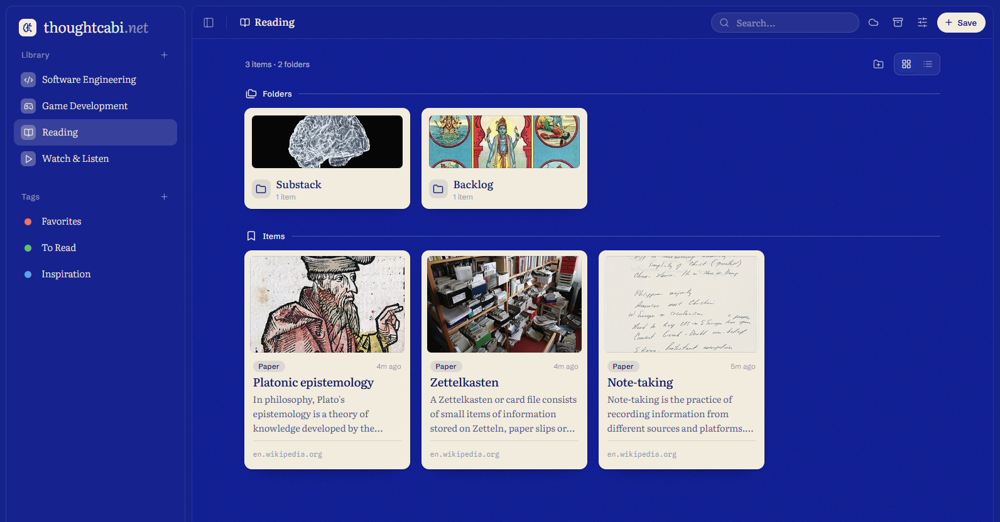

<div align="center">
  

  <h1>thoughtcabi.net</h1>

  <p><strong>A cabinet for the websites you meant to come back to.</strong></p>

  <p>Paste a link and it files itself: title, description, thumbnail, source.</p>

  <p>
    <a href="https://thoughtcabi.net"><strong>Open the cabinet</strong></a>
    &nbsp;·&nbsp;
    <a href="CONTRIBUTING.md">Contributing</a>
  </p>

  <p>
    <a href="CONTRIBUTING.md"></a>
    <a href="LICENSE"></a>
  </p>

  
</div>

---

> **ENCYCLOPEDIA** [Easy: Success] A [_Zettelkasten_](https://en.wikipedia.org/wiki/Zettelkasten). A slip-box. Niklas Luhmann, sociologist, kept ninety thousand index cards in a set of wooden drawers, each card holding one idea and a number pointing at its neighbours. He wrote seventy books out of it and named the box as his collaborator. Nobody has improved on the principle in sixty years. They have only made the drawers electric.

`thoughtcabi.net` is an open source place to put the websites you want to keep. Bookmark the web. Paste a link and it becomes a card carrying the page's own title, description and picture. Put it on a shelf, drop it in a folder, give it a tag. There is nothing to set up, and the cabinet is kept in your browser's `localStorage`, so it stays on the machine you saved it from until you point it somewhere of your own.

## What it does

**Paste a link, anywhere.** `Ctrl`+`V` on the page and a card lands immediately, then fills itself in with the page's real title, description, thumbnail and favicon.

**Shelves, folders and tags.** The sidebar lists every shelf you have. Folders go inside a shelf, and eight colour-anchored tags cut across everything, one name per colour. Drag anything anywhere, and drag a tag from the sidebar onto a card to apply it.

**Two views.** Grid for calm, rows for density. The card has one fixed shape, and everything on it except the title is optional.

**Export and import.** Export writes a single JSON file holding every shelf, folder, card and tag. Import takes it back and shows you what is inside before it touches anything: merge pours it into what you have, replace swaps the lot.

**Somewhere of your own to keep it.** Point the cabinet at a folder on this computer, the one your sync app already watches, or at a private GitHub repository, and it keeps itself there as that same JSON file. Open the app on another machine, point it at the same place, and both sides merge: cards arrive with the same small pop as a card you just saved, and it only asks you a question when there is one only you can answer. One place is the home and syncs both ways; anything else you add is a backup that only ever receives. The app never sends the cabinet anywhere you did not choose, and with nothing connected there is nothing to send.

## Keyboard and gestures

| Action                         | How                                                |
| ------------------------------ | -------------------------------------------------- |
| Save a pasted link             | `Ctrl`/`Cmd` + `V` anywhere outside a text field   |
| Focus search                   | `Ctrl`/`Cmd` + `K`                                 |
| Undo                           | `Ctrl`/`Cmd` + `Z`, or Undo on the toast           |
| Collapse or expand the sidebar | `Ctrl`/`Cmd` + `B`                                 |
| Close any dialog               | `Esc`, or click the backdrop                       |
| Move a card or folder          | Drag it, and the nearest gap between siblings wins |
| Move into a folder             | Drop onto the folder tile                          |
| Open while dragging            | Hover a breadcrumb or shelf for a moment           |
| Assign a tag                   | Drag the tag from the sidebar onto a card          |
| Cancel a drag                  | `Esc`, right-click, or drop on nothing             |

## Running it

```sh
npm install
npm run dev
```

React 18, TypeScript, Vite. Nothing to start on the side, though `node relay/server.mjs` in a second terminal gets you link previews for ordinary web pages.

## Roadmap

- [x] Spanish translation
- [x] External storage: a folder on this computer, or a private GitHub repository
- [ ] The rest of the destinations. Google Drive, OneDrive, and your own WebDAV server
- [ ] More shades of blue. The four currently in the app are cleared by the Moralintern for civilian use; anything deeper is still before the Commission, and the greens were a concession.

## Where your cabinet lives

In your browser, in `localStorage`, and nowhere else until you say otherwise.

Connect a place and the cabinet also lives there, in the open, as one readable JSON file you can copy, read or drop back into the import box. A folder never touches a network at all. GitHub takes a fine grained token you make yourself, scoped to that one repository, and it is stored in this browser so sync survives a reload; Disconnect forgets it, and you delete it on github.com. Which repository is entirely yours to pick: private, public, yours, an organisation's.

Nothing third party ever runs on the page. No analytics, no accounts, no vendor SDK, and nothing in the `<head>` points at another origin.

## Contributing

Issues and pull requests are welcome. See [CONTRIBUTING.md](CONTRIBUTING.md).

Inspired by [Excalidraw](https://excalidraw.com), and named after the Thought Cabinet in [Disco Elysium](https://discoelysium.com).

## License

[MIT](LICENSE)
